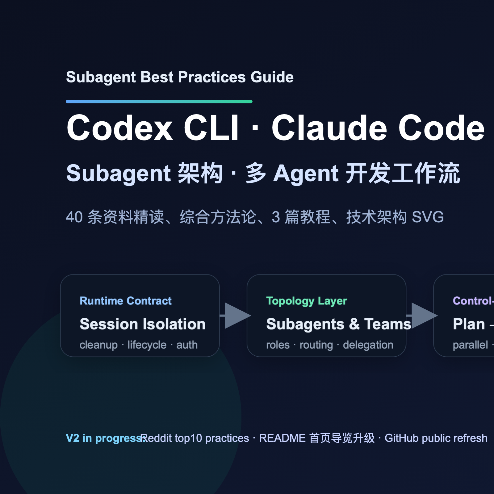

# Subagent Best Practices Guide



> 原版矢量图：[`assets/cover-subagent-guide.svg`](assets/cover-subagent-guide.svg)

一份围绕 **Codex CLI / Claude Code / subagent 架构 / 多 agent 开发工作流** 的中文实践指南。

这份仓库基于 **50 条资料精读** 与综合整理（官方 / GitHub / X / YouTube / Reddit 各 10 条），目标不是“收集链接”，而是沉淀出一套能直接落地的实践框架。

## README 导览

- 如果你只想快速抓主线：先看[研究综述](research/synthesis.md)
- 如果你想直接照着搭：先看 3 篇 `docs/` 教程
- 如果你想核对证据：看[资料索引](research/source-index.md)
- 如果你想拿图去讲方案：看 `assets/` 里的 2 张 SVG

## 你会在这里看到什么

- **Codex CLI + subagent** 最佳实践
- **Claude Code + subagent** 最佳实践
- **通用 subagent 架构与开发工作流**
- **50 条资料的综合 synthesis**
- **技术架构 SVG**
- **可追溯的资料索引**

## 推荐阅读顺序

1. [`docs/01-codex-cli-subagent-best-practices.md`](docs/01-codex-cli-subagent-best-practices.md)
2. [`docs/02-claude-code-subagent-best-practices.md`](docs/02-claude-code-subagent-best-practices.md)
3. [`docs/03-subagent-architecture-and-dev-workflow.md`](docs/03-subagent-architecture-and-dev-workflow.md)
4. [`research/synthesis.md`](research/synthesis.md)
5. [`research/source-index.md`](research/source-index.md)

## 核心结论

这套研究最后收敛到一个比较稳的 4 层模型：

| 层 | 关注点 |
|---|---|
| Runtime Contract | session 隔离、生命周期、cleanup、auth |
| Topology Layer | subagent / team / role / routing |
| Control-Flow Layer | plan、parallel、gather、review、checkpoint |
| Worker Profile Layer | model、tools、permissions、worktree、hooks |

## 适合谁看

- 想用 **Codex CLI / Claude Code** 搭 subagent 工作流的人
- 想从单 agent 走向多 agent / subagent 架构的人
- 想把 agent 真正用于开发、审查、交付的人
- 想理解 **workflow、routing、review gate、context isolation** 的人

## 仓库结构

```text
.
├── README.md
├── LICENSE
├── docs/
│   ├── 01-codex-cli-subagent-best-practices.md
│   ├── 02-claude-code-subagent-best-practices.md
│   └── 03-subagent-architecture-and-dev-workflow.md
├── research/
│   ├── synthesis.md
│   └── source-index.md
└── assets/
    ├── cover-subagent-guide.svg
    └── subagent-architecture-overview.svg
```

## 范围说明

本仓库公开的是**可阅读成品**，不包含：
- 内部 handoff 文件
- 原始缓存 raw 数据
- 项目过程管理文件
- 中间噪音工件

## 使用建议

如果你只是想快速上手：
- 先看 `Claude Code` 或 `Codex CLI` 对应教程
- 再看 `subagent architecture` 那篇
- 最后看 `synthesis`，用来统一心智模型

如果你是要搭团队级多 agent 系统：
- 先看 `synthesis`
- 再看架构教程
- 最后按需要回看 Codex / Claude Code 的专项章节

## 本轮 v2 新增

- 补入 **Reddit top10 practices** 研究，并只吸收可交叉验证的社区信号
- 扩充 README 首页导览
- 增补仓库封面 SVG
- 对公开版做了一轮压缩与收口

## 证据使用原则

- **Evidence**：来自官方文档、公开仓库、可核对的帖子与演讲内容
- **Inference**：基于多源证据做的综合判断
- 只有可核实、可迁移的内容才进入主结论；高噪音社区观点不会直接当成最佳实践

## License

MIT
