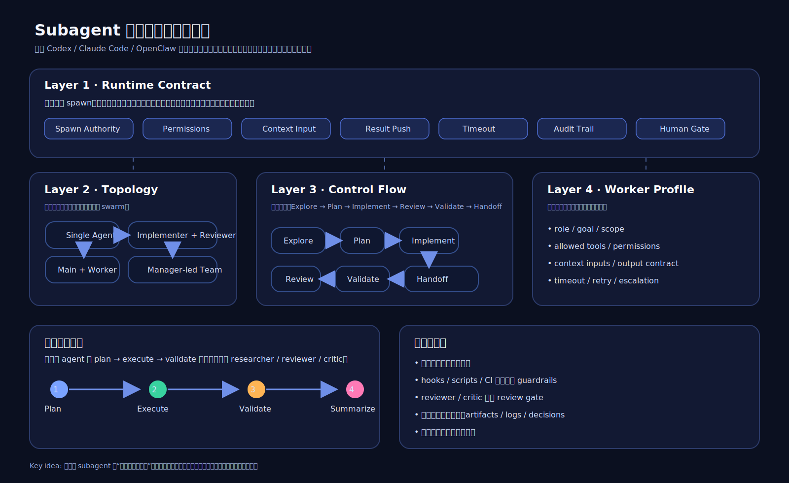

# Subagent Best Practices Guide

一份围绕 **Codex CLI / Claude Code / subagent 架构 / 多 agent 开发工作流** 的中文实践指南。

这份仓库基于 40 条资料的系统精读与综合整理，重点输出：

- Codex CLI + subagent 最佳实践
- Claude Code + subagent 最佳实践
- 通用 subagent 架构与开发工作流
- 一张技术架构风格 SVG 图
- 一份综合 synthesis
- 一份资料索引

## 推荐阅读顺序

1. [`docs/01-codex-cli-subagent-best-practices.md`](docs/01-codex-cli-subagent-best-practices.md)
2. [`docs/02-claude-code-subagent-best-practices.md`](docs/02-claude-code-subagent-best-practices.md)
3. [`docs/03-subagent-architecture-and-dev-workflow.md`](docs/03-subagent-architecture-and-dev-workflow.md)
4. [`research/synthesis.md`](research/synthesis.md)
5. [`research/source-index.md`](research/source-index.md)

## 架构图



## 仓库结构

```text
.
├── README.md
├── LICENSE
├── docs/
│   ├── 01-codex-cli-subagent-best-practices.md
│   ├── 02-claude-code-subagent-best-practices.md
│   └── 03-subagent-architecture-and-dev-workflow.md
├── research/
│   ├── synthesis.md
│   └── source-index.md
└── assets/
    └── subagent-architecture-overview.svg
```

## 范围说明

本仓库公开的是**可阅读成品**，不包含：
- 内部 handoff 文件
- 原始缓存 raw 数据
- 项目过程管理文件
- 中间噪音工件

## 适合谁看

- 想用 Codex CLI / Claude Code 搭 subagent 工作流的人
- 想从单 agent 走向多 agent / subagent 架构的人
- 想把 agent 真正用于开发、审查、交付的人

## License

MIT
