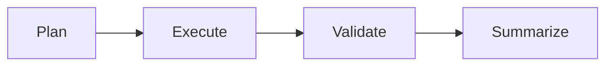
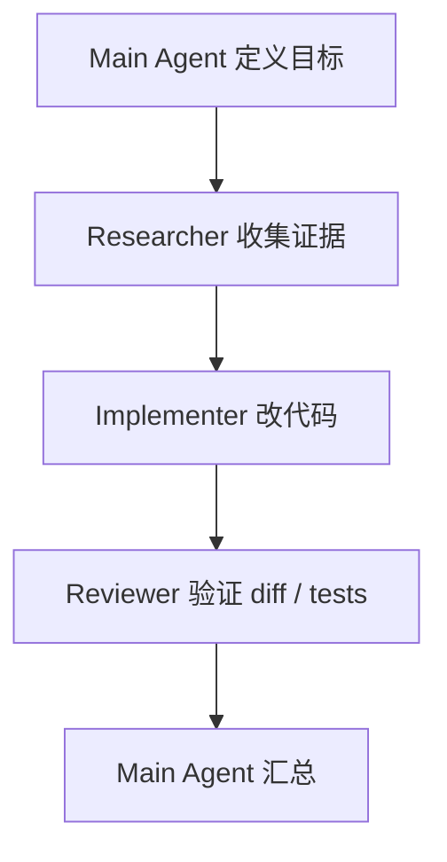
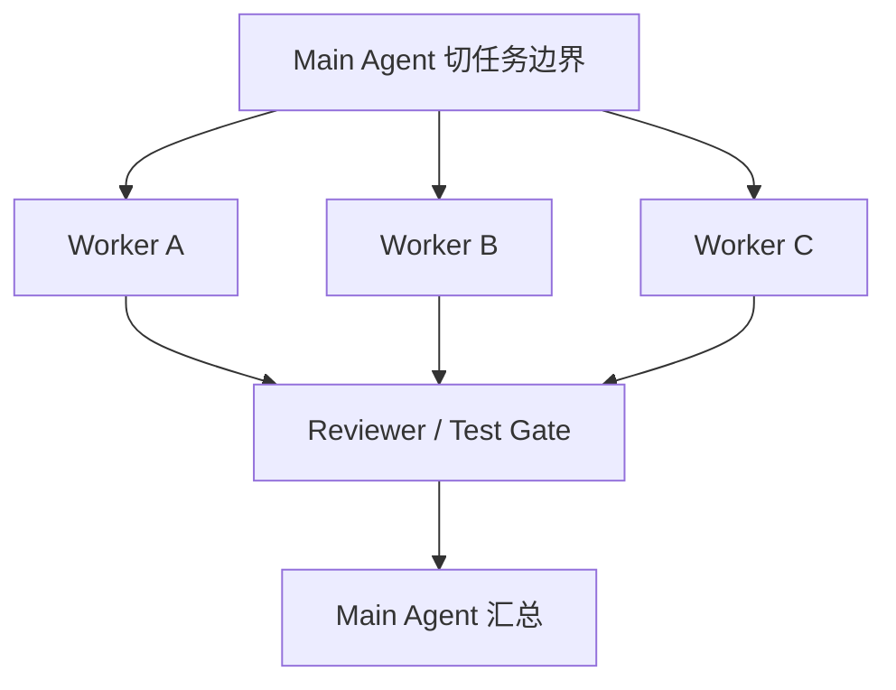

# Codex CLI + Subagent 最佳实践

## 先结论

如果你要把 Codex CLI 用成稳定的开发系统，而不是偶尔灵光一现的聊天式编码器，关键不是多开几个 agent，而是先把 **单 agent 闭环、repo 结构、验证链路、工具边界** 建好，再逐步引入 subagent。

一句话版：**先把 `plan → execute → validate` 跑稳，再把可并行、可隔离、可审查的工作交给 subagent。**

---

## 1. Codex CLI 适合在什么场景上 subagent

### 推荐进入 subagent 的时机

满足任一条就可以考虑：

- 主线程上下文已经被研究材料、日志、代码探索挤满。
- 任务天然可并行，比如前后端、文档、测试、数据脚本可以拆开。
- 需要不同角色分工，比如 implementer、reviewer、critic。
- 某个任务风险较高，适合隔离到受限 worker 中执行。
- 你已经能稳定跑通单 agent 闭环，但希望提升吞吐量或减少主线程噪音。

### 不建议一上来就 subagent 的场景

- 需求还没澄清。
- 主线程自己都没搞懂仓库。
- 没有测试、截图、脚本校验等验证路径。
- 多个 worker 会同时碰同一文件。
- 你只是想“更快”，但没有边界、权限和结果协议。

**Recommendation：** Codex CLI 里的 subagent 应该是“受约束的执行单元”，不是“多开几个万能助手”。

---

## 2. 先搭好最小可行闭环

在任何 subagent 之前，先把这条链路跑稳：



### 每一段分别要解决什么

| 阶段 | 要点 | 失败信号 |
|---|---|---|
| Plan | 明确目标、范围、输入、输出、禁区 | 提示词很长但目标不清 |
| Execute | 按边界修改文件、运行命令、生成产物 | 到处试错、上下文失控 |
| Validate | 测试、lint、截图、脚本校验、diff review | 只说“应该可以” |
| Summarize | 输出结果、证据、风险、下一步 | 只有流水账，没有结论 |

**Evidence：** 当前资料池对 Codex 的直接官方多 agent 细节还不如 Claude Code 丰富，但官方仓库、社区实践与近期产品动态都支持一个共识：agent 的价值不只在模型，而在可执行工作流与工具集成。  
**Inference：** 因此在 Codex CLI 上，最佳实践应优先落在 runtime contract、验证链路和插件/工具抽象，而不是押注某种 prompt 技巧。

---

## 3. Codex CLI 的 subagent 运行时合同

想让多 agent 稳，不要只写 prompt，要先写“运行时合同”。

### 建议明确这 7 件事

1. **谁可以 spawn 子 agent**  
   默认只有主控可以拉起 subagent，避免层层无限派生。

2. **每个子 agent 的职责边界**  
   例如：研究、实现、测试、审查，不要混成一个角色。

3. **允许使用哪些工具**  
   读、写、测试、网络、发布应分层授权。

4. **上下文如何传递**  
   传 brief、约束、目标文件、输出格式，不传整段混乱聊天历史。

5. **结果如何回传**  
   回传 artifact、diff、测试结果、风险，不回传大段废话。

6. **什么时候超时 / fallback**  
   子 agent 长时间无产出，就中止、改派或降级回主线程。

7. **哪些动作必须人工确认**  
   如删除数据、发布、越权外发、批量重构核心模块。

### 推荐的 worker profile

| 字段 | 含义 |
|---|---|
| role | 角色名，如 researcher / implementer / reviewer |
| scope | 可处理的任务边界 |
| allowed_tools | 工具白名单 |
| output_contract | 必须交付什么 |
| timeout | 最大运行时长 |
| escalation_rule | 何时上报主控 |

---

## 4. repo 要改造成 agent-native，而不是 prompt-native

这是当前资料里最值得沉淀的共识之一。

### 最小骨架

```text
repo/
  AGENTS.md 或 CLAUDE.md
  docs/
  skills/
  hooks/
  scripts/
  modules/*/LOCAL_GUIDE.md
```

### 各层分别做什么

| 层 | 作用 |
|---|---|
| 顶层规则文件 | 说明 repo map、命令、禁区、输出要求 |
| docs/ | 架构、ADR、runbook、模块说明 |
| skills/ | 把高频工作流沉淀成可复用专家模式 |
| hooks/ scripts/ | 强制格式化、测试、敏感拦截 |
| 局部说明文件 | 给高风险模块提供近场上下文 |

**Evidence：** 高质量社区资料明确强调：prompt 是临时的，structure 是永久的；repo memory、skills、hooks、docs、局部上下文，决定 agent 是否像工程师工作。  
**Recommendation：** 即便你今天主要用 Codex CLI，这套结构也值得直接采用，因为它不依赖某一家模型厂商。

---

## 5. Codex CLI 的推荐 subagent 拓扑

### P0：单 agent
适合：需求澄清、小修小补、单文件改动。

### P1：主控 + 一个 researcher / implementer
适合：先探索再实现，减少主线程噪音。

### P2：主控 + 并行 implementers + reviewer
适合：任务边界清楚、可并行、验证明确。

### P3：主控 + planner + implementers + critic
适合：中大型功能、重构、跨模块改动。

### 一条硬规则

**同一代码区单写者原则。**

如果两个 subagent 同时写同一块代码，你得到的通常不是速度翻倍，而是冲突翻倍。

---

## 6. 推荐开发工作流

### 工作流 A：研究 → 实现 → 审查



适合：你需要联网核验、需要对方案有把握、且不希望主线程被细节淹没。

### 工作流 B：并行实现 → 汇总验证



适合：前提是边界清楚，而且各 worker 不要撞文件。

### 工作流 C：高风险改动隔离

- 主线程只负责规划与审查。
- 高风险命令放到受限子 agent 执行。
- 回传必须带日志、diff、测试与风险说明。

适合：依赖升级、大量重构、自动化批量修改。

---

## 7. 验证优先，而不是速度优先

### 没有验证的 subagent，等于放大错误

建议每个 worker 最少带一项验证：

- 单元测试
- lint / typecheck
- 截图或录屏
- 数据校验脚本
- diff review
- 预期输出检查

### 推荐的结果协议

每个子 agent 返回：

1. 做了什么
2. 改了哪些文件
3. 运行了什么验证
4. 结果如何
5. 风险 / 未覆盖项
6. 建议下一步

这样主控可以快速 review，而不是重新读完整过程。

---

## 8. 插件 / 外部工具层怎么设计

近期官方信号表明，Codex 正在把 plugins 推到产品层。即便今天你的环境还没全面可用，也应该提前按“可替换工具层”设计。

### 推荐做法

- 把外部工具访问封成统一接口，而不是把具体产品硬编码到 prompt 中。
- 区分三类能力：
  - 模型能力
  - 仓库能力
  - 外部工具能力
- 为工具调用设计权限边界、审计日志和失败回退。
- 不让每个 worker 默认拥有所有外部工具权限。

### 为什么这很重要

多 agent 的问题，很多时候不在“谁更聪明”，而在：

- 谁能访问什么
- 访问后会不会污染主线程
- 出错后怎么回退
- 如何审计结果是不是可信

---

## 9. 反模式

### 反模式 1：把 subagent 当多开聊天框
结果：上下文重复、职责混乱、输出不可审。

### 反模式 2：没有边界就并行
结果：改动互相覆盖，后面全靠人工救火。

### 反模式 3：没有验证链路
结果：产出看起来很多，但可信度很低。

### 反模式 4：把 prompt 当架构
结果：每次都要重新解释项目，系统不可持续。

### 反模式 5：所有 worker 全权限
结果：速度可能更快，但风险不可控。

---

## 10. 一套可直接落地的模板

### 主控 brief 模板

```markdown
目标：
范围：
输入材料：
禁止修改：
目标文件：
验证要求：
输出格式：
超时 / 上报条件：
```

### reviewer 检查清单

```markdown
- 任务是否完成？
- 是否改了不该改的地方？
- 是否有验证证据？
- 是否遗漏关键风险？
- 是否和既有规则冲突？
```

### worker 输出模板

```markdown
结论：
改动文件：
验证：
风险：
下一步建议：
```

---

## 11. 最终建议

如果你现在就要把 Codex CLI 用起来，建议按这个顺序：

1. 建顶层规则文件与 repo map。
2. 把测试、lint、脚本入口整理清楚。
3. 先稳定单 agent 的 `plan → execute → validate`。
4. 再引入 researcher / reviewer 这类低冲突 subagent。
5. 最后再做并行 implementers、插件层、复杂团队编排。

## 12. 一句话收束

**Codex CLI + subagent 的最佳实践，不是“更多 agent”，而是“更清晰的边界、更强的验证、更 durable 的 repo 结构”。**
