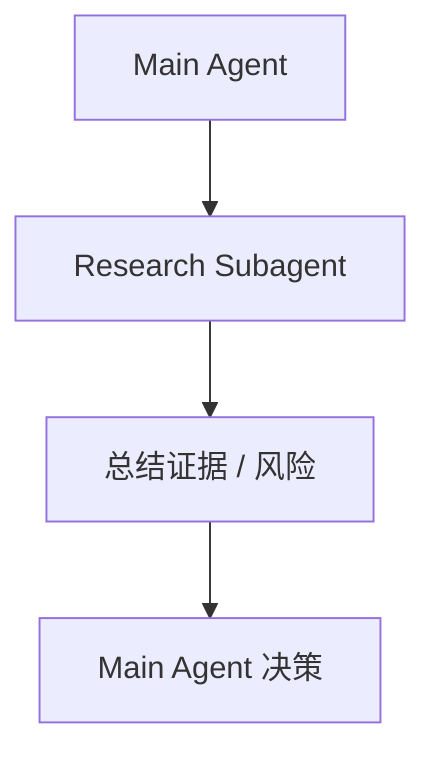
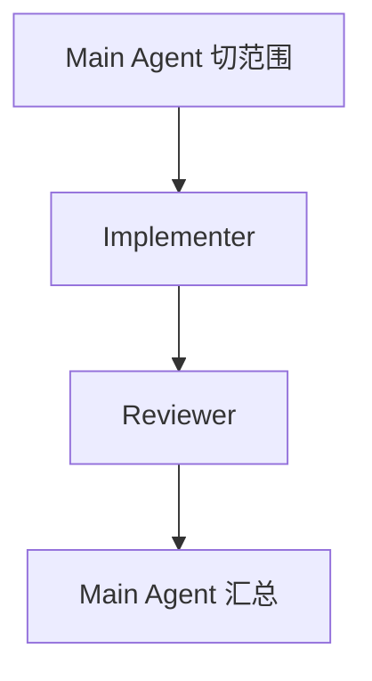
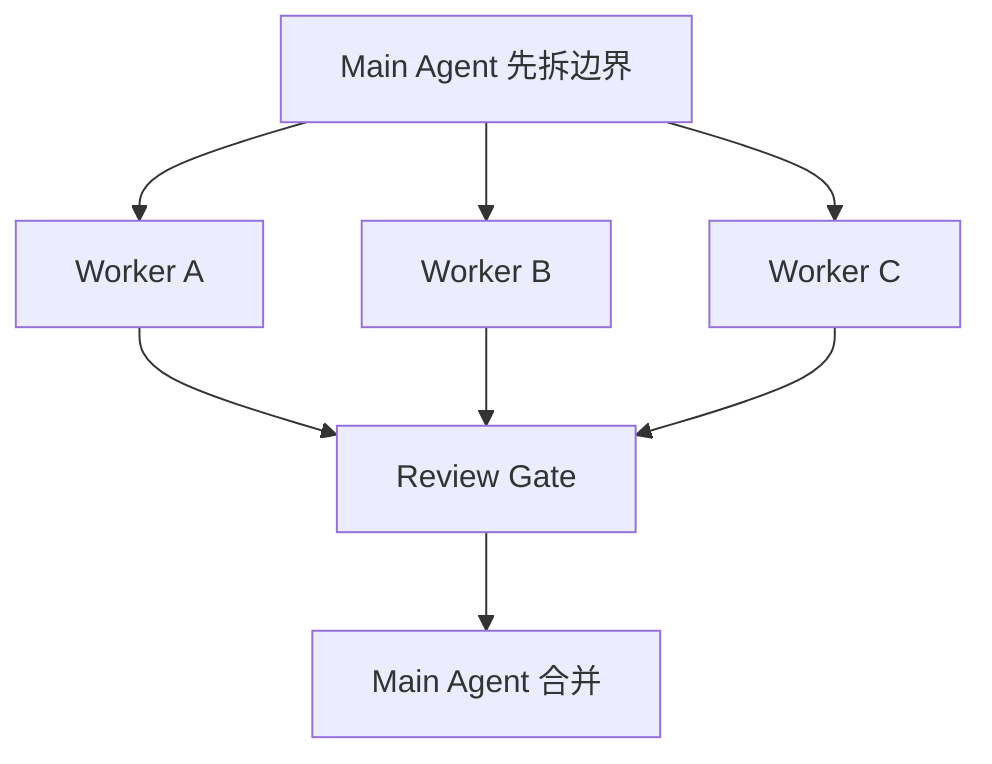

# Claude Code + Subagent 最佳实践

## 先结论

在当前资料池里，Claude Code 是“多 agent 可操作细节最完整”的参照物。真正有效的实践不是堆 prompt，而是把 **subagents、agent teams、hooks、permissions、worktree / context 管理、verification-first** 这些控制面一起用起来。

一句话版：**Claude Code 的强项不只是会写代码，而是已经把 delegation、workflow、guardrails 文档化了。**

---

## 1. 为什么 Claude Code 值得当主骨架

相比其他资料源，Claude Code 相关官方内容已经比较完整地覆盖了：

- sub-agents
- agent teams
- best practices
- common workflows
- hooks / permissions / 上下文管理

这意味着它不只是“能叫几个 agent 干活”，而是对以下问题给了比较清晰的答案：

- 什么时候委派
- 如何限制子 agent
- 怎样组织 team
- 如何做验证与恢复
- 如何把 repo 变成稳定工作环境

**Evidence：** 当前 40 条资料里，Claude Code 官方文档与高质量社区实践，对 subagent / team / workflows / repo-native memory 的描述最连续、最可操作。  
**Recommendation：** 如果目标是沉淀今天能用的最佳实践，可以把 Claude Code 视为“成熟参考实现”，再抽象出通用方法。

---

## 2. Claude Code 里的 subagent，不是“更小的 Claude”

它更像是：

- 有明确角色边界的 worker
- 被主控按任务拉起的执行单元
- 可以和 hooks、permissions、repo rules 协同工作的运行时角色

### 推荐的角色分工

| 角色 | 适合做什么 |
|---|---|
| researcher | 查资料、读代码、梳理上下文 |
| planner | 拆任务、排依赖、写执行计划 |
| implementer | 按边界改代码 |
| reviewer | 检查 diff、测试、覆盖度 |
| critic | 专找风险、遗漏、冲突 |

### 核心原则

- 一个 worker 一个主目标。
- 明确输入材料、边界、交付格式。
- 子 agent 产出的是 artifact，不是长对话。
- 重要风险必须回到主控做裁决。

---

## 3. Claude Code 官方实践里最重要的 5 个共识

### 3.1 先单 agent，复杂度按需升级

不要因为支持 subagent 就默认用 team。

推荐升级路径：

1. 单 agent
2. 单一 subagent delegation
3. implementer + reviewer
4. manager-led team
5. 更动态的多 agent handoff

### 3.2 verification-first

Claude Code 相关资料反复强调：

- 先定义验证，再大规模执行。
- 测试、lint、截图、diff review 都是第一等公民。
- 如果没有验证链路，多 agent 只会放大错误。

### 3.3 context hygiene

子 agent 不应该继承一整段混乱主线程历史。

更稳的方式是：

- 传目标
- 传边界
- 传必要上下文
- 传目标文件
- 传输出协议

### 3.4 hooks / permissions 不是附加项

如果能自动拦截危险操作、强制执行校验，就不要全靠模型“记得遵守”。

### 3.5 repo-native memory 比 prompt 更 durable

重复出现的规则、命令、禁区、高风险模块说明，应该写进 repo，而不是每次聊天都重讲一遍。

---

## 4. 推荐的 Claude Code repo 结构

```text
repo/
  CLAUDE.md
  .claude/
    skills/
    hooks/
  docs/
  scripts/
  src/**/CLAUDE.md
```

### 4.1 顶层 CLAUDE.md 应该很短但很密

只保留最关键内容：

- 项目目标
- repo map
- 常用命令
- 禁区
- 产出要求

不要把所有背景都塞进去，不然真正重要的规则会被稀释。

### 4.2 skills/ 用来沉淀高频工作流

例如：

- code review
- bug triage
- refactor
- release checklist
- test diagnosis

这样你不用每次重新发明角色和步骤。

### 4.3 hooks/ 用来做强制 guardrails

例如：

- 运行 formatter / lint
- 阻止修改敏感目录
- 检查禁止命令
- 在提交前跑关键测试

### 4.4 模块级 CLAUDE.md 用来保护高风险区

例如：

- auth
- billing
- infra
- persistence

本质上是在给子 agent 提供“就近真相源”。

---

## 5. Claude Code 推荐工作流

### 工作流 A：研究型任务



适合：技术选型、读陌生模块、查近期资料。

### 工作流 B：实现 + 审查



适合：中小型改动，且需要质量门。

### 工作流 C：并行开发



前提：**单写者原则**，不要多个 worker 共享同一改动面。

### 工作流 D：agent teams

适合：复杂项目、跨角色协作、需要长期工作流的场景。

但不要一开始就上 team。team 只有在以下条件成立时才值得：

- 边界稳定
- 工具分配清楚
- review gate 明确
- 状态可观测
- 失败可恢复

---

## 6. 上下文管理：Claude Code 成败分水岭之一

### 好的上下文传递

- 只给必要材料
- 提供 repo map
- 指向目标文件
- 明确“不做什么”
- 说明验证要求

### 坏的上下文传递

- 把整段聊天历史甩过去
- 让子 agent 自己猜任务边界
- 不说明已有决策
- 不说明产物应该落在哪

### 推荐 brief 模板

```markdown
目标：
角色：
输入材料：
边界：
目标文件：
验证要求：
输出格式：
遇到什么情况必须上报：
```

---

## 7. review gate：Claude Code 多 agent 的质量闸门

主控收到子 agent 结果后，不应直接转发或接受，而应先做 review。

### 最少检查 5 项

1. 任务真的完成了吗？
2. 有没有证据？
3. 有没有和要求或既有决策冲突？
4. 有没有 prompt 注入残留或越权动作？
5. 有没有遗漏关键风险和下一步？

### 结果只分三类

- Pass
- Revise
- Escalate

这能显著减少“表面完成，实际烂尾”的问题。

---

## 8. Claude Code 最值得借鉴的，不只是 subagent，而是整个控制面

很多人会把注意力放在“怎么写一个很厉害的子 agent prompt”。

但真正更重要的是：

- hooks
- permissions
- workflows
- skills
- worktree / context isolation
- resume / recovery
- review gate

这些东西加起来，才构成一个稳定的 agent system。

**Inference：** Claude Code 的真正价值，在于它让“多 agent 工程化”从口号变成了可执行控制面。哪怕你以后不只用 Claude，也值得沿这个方向设计系统。

---

## 9. 常见反模式

### 反模式 1：角色名很多，边界却没有
结果：大家都像万能助手，职责重叠。

### 反模式 2：所有规则都只写在 prompt 里
结果：复用差、恢复差、团队难维护。

### 反模式 3：没有 hooks / guardrails
结果：模型偶尔发挥得很好，但系统不可控。

### 反模式 4：主控不 review
结果：把中间产物误当最终结果。

### 反模式 5：并行开发不做写隔离
结果：冲突和返工暴涨。

---

## 10. 一套可以直接采用的落地建议

### P0

- 建顶层 `CLAUDE.md`
- 明确 repo map 和常用命令
- 建基础验证链路
- 先用单 agent 跑顺工作流

### P1

- 引入 researcher / reviewer 两类子 agent
- 把高频动作沉淀成 skills
- 用 hooks 强制执行关键检查
- 给高风险模块写局部上下文文件

### P2

- 做 implementer 并行
- 引入 critic / review gate
- 做状态可观测与恢复
- 再考虑更复杂的 agent teams

---

## 11. 一句话收束

**Claude Code + subagent 的最佳实践，本质上不是“怎么叫更多 agent”，而是“怎么把 delegation、context、guardrails、review 变成系统能力”。**
