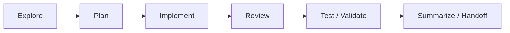
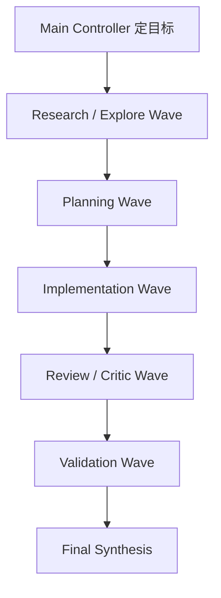

# Subagent 架构设计与开发工作流最佳实践

## 先结论

跨 Codex、Claude Code、OpenClaw 以及更广义的多 agent 框架，当前最稳的共识不是某个模型更强，而是：**subagent 系统必须显式设计运行时合同、协作拓扑、控制流和 worker profile。**

可以把它压缩成一个四层模型：

1. Runtime Contract
2. Topology Layer
3. Control-Flow Layer
4. Worker Profile Layer

这四层一旦清楚，具体底层是 Codex、Claude Code、OpenClaw、AutoGen、ADK 还是 CrewAI，差别都会小很多。

---

## 1. 为什么需要一个通用架构

很多团队一提多 agent，就直接进入：

- 角色命名
- 提示词设计
- 并行数量
- 模型选择

但真正决定系统能不能长期运行的，往往是更底层的问题：

- 谁能 spawn 子 agent
- 子 agent 有哪些权限
- 结果如何回传
- 怎样超时与恢复
- 如何避免并发写冲突
- 谁来审查中间产物

**Evidence：** 官方与社区资料反复表明，仅靠 prompt 不能解决权限、恢复、并发、安全、审计和上下文污染问题。  
**Recommendation：** 先画清系统骨架，再谈角色提示词。

---

## 2. 四层模型

## 2.1 Runtime Contract

这是最底层，也最容易被忽略。

### 需要先回答的 8 个问题

1. 谁可以创建 subagent？
2. 创建后是否会话隔离？
3. 子 agent 可以读写哪些资源？
4. 结果是 push 回传还是主控 pull？
5. 什么情况下超时、取消或回收？
6. 哪些动作需要人工确认？
7. 日志、产物、状态如何留痕？
8. 崩溃后如何 resume？

### 如果这层没设计好，会出现什么

- agent 一层套一层，无法治理
- 大家都有全权限
- 主控不知道谁还活着
- 结果散在聊天记录里
- 超时和失败无人处理

---

## 2.2 Topology Layer

也就是“你打算让这些 agent 以什么形态协作”。

### 常见拓扑

| 拓扑 | 适用场景 | 风险 |
|---|---|---|
| 单 agent | 小任务、低复杂度 | 吞吐有限 |
| 主控 + 1 worker | 研究或实现单分支任务 | 主控仍可能过载 |
| 主控 + implementer + reviewer | 需要质量门 | 流程比单 agent 慢 |
| manager-led team | 中大型复杂任务 | 编排成本变高 |
| swarm / 动态 handoff | 高探索性、长链任务 | 可控性最差 |

### 一条默认原则

**先单 agent，再按需升级复杂度。**

不要为了“看起来先进”直接上 swarm。

---

## 2.3 Control-Flow Layer

多 agent 真正跑起来，靠的是控制流，而不是角色名。

### 推荐的标准阶段



### 每一段的职责

| 阶段 | 目标 |
|---|---|
| Explore | 拉资料、读代码、摸清问题空间 |
| Plan | 切任务、排依赖、写边界 |
| Implement | 执行改动或产出 |
| Review | 查错、查冲突、查越权 |
| Validate | 运行测试、截图、脚本、预期检查 |
| Summarize / Handoff | 交付 artifact 与后续建议 |

### 三条高价值约束

1. **同一代码区单写者原则**
2. **并行前先切边界**
3. **返回 artifact，不返回聊天记录**

---

## 2.4 Worker Profile Layer

不要让 worker 只有名字，没有合同。

### 每个 worker 至少要有这些字段

| 字段 | 作用 |
|---|---|
| role | 角色名 |
| goal | 主目标 |
| scope | 工作边界 |
| allowed_tools | 工具白名单 |
| context_inputs | 允许读取哪些上下文 |
| output_contract | 交付格式 |
| budget | 时间 / token / 重试预算 |
| escalation_rule | 何时必须上报 |

### 为什么这层重要

因为很多系统表面上有角色，实质上仍是“全能聊天机器人 * N”。

只有把 worker profile 显式化，才可能做：

- 权限收口
- 成本管理
- 质量对比
- 可替换模型路由
- 更可靠的审计

---

## 3. 通用开发工作流

## 3.1 最小可行闭环

先把这个闭环跑顺：

```text
plan → execute → validate
```

没有验证，多 agent 只会把错误扩散得更快。

## 3.2 推荐的 wave-based workflow



### 为什么 wave 比完全自由 handoff 更稳

- 每一波目标更清楚
- 更容易做阶段汇报
- 更容易发现阻塞
- 更容易做成果归档
- 更适合人工在关键点介入

## 3.3 什么时候进入下一波

建议有明确门槛：

- Explore 完成：问题空间和证据足够清楚
- Plan 完成：边界、依赖、目标文件都明确
- Implement 完成：产物存在
- Review 完成：主要错误与冲突已处理
- Validate 完成：有客观证据证明可用

---

## 4. repo-native 环境设计

让 agent 稳定工作的，不只是 orchestrator，还包括 repo 本身。

### 推荐最小骨架

```text
repo/
  AGENTS.md / CLAUDE.md
  docs/
  skills/
  hooks/
  scripts/
  memory/
  artifacts/
  modules/*/LOCAL_GUIDE.md
```

### 设计原则

- **规则近场可见**：模型能在工作区附近找到规则。
- **文档分层**：顶层总览，模块局部补细节。
- **重复动作脚本化**：不要每次都靠自然语言触发。
- **高风险区域显式标注**：少让 agent 猜。
- **结果留痕**：让主控、reviewer、人类都能追溯。

---

## 5. 验证、可观测性与恢复

## 5.1 验证优先

每个关键产出都应尽量绑定至少一种验证：

- 测试
- lint / typecheck
- 截图 / 录屏
- 数据对账脚本
- diff review
- checklist

## 5.2 可观测性不是锦上添花

至少应该知道：

- 当前有哪些 agent 在运行
- 各自在什么阶段
- 有没有阻塞 / 超时
- 产物在哪
- 谁拥有写权限

## 5.3 恢复能力

子 agent 或主线程崩了之后，至少要能恢复：

- 目标
- 当前阶段
- 已产出的 artifact
- 未完成项
- 风险与阻塞

如果一断就全靠人类重新读聊天记录，这个系统就还不够工程化。

---

## 6. 安全与治理

### 最低安全基线

- 最小权限默认
- 读写角色分离
- 危险操作前确认
- hooks / policy 拦截高风险命令
- 高风险变更必须 review

### 为什么多 agent 更需要治理

单 agent 出错，通常是一处错误。  
多 agent 出错，可能是错误被复制、放大、并行扩散。

所以治理能力必须和并行能力一起增长。

---

## 7. 反模式

### 反模式 1：把 prompt 当架构
结果：系统全靠记忆和临场发挥，不可持续。

### 反模式 2：过早使用 swarm
结果：状态难追、边界难管、错误难定位。

### 反模式 3：没有 review gate
结果：把中间产物误当最终结果。

### 反模式 4：所有 worker 全权限
结果：速度变快，但风险失控。

### 反模式 5：并发写同一区域
结果：返工、冲突、上下文污染一起上升。

### 反模式 6：没有 artifact discipline
结果：结果散落在对话里，无法 handoff、审计、恢复。

---

## 8. 推荐实施顺序

### Phase 1：先让单 agent 像工程师

- 建规则文件
- 建 repo map
- 建验证链路
- 统一输出格式

### Phase 2：引入有边界的 subagent

- researcher
- implementer
- reviewer

先做少量、清晰、低冲突的委派。

### Phase 3：引入 review gate 和 observability

- 阶段状态
- 超时处理
- 产物归档
- 风险上报

### Phase 4：再做 team / plugin / 更复杂编排

在前 3 阶段没稳定前，不建议追求更炫的多 agent 拓扑。

---

## 9. 一句话收束

**subagent 架构设计的核心，不是把一个模型拆成很多人格，而是把“角色、权限、流程、验证、留痕、恢复”做成稳定系统。**
